# インフラ構成
本リポジトリで構築するインフラ構成についてまとめる。  

## 構成図

## ネットワーク
サブネットは以下に分割する。  
- public
- private(Web,AP用)
- private(DB用)
- private(VPCエンドポイント用)

また、1aと1cの2つを使用したマルチAZとする。

## ALB
- publicサブネットおよびprivateサブネットにそれぞれ設置する
- 今回は検証なのでHTTPSは利用しない  
- public, privateいずれもログをS3に転送する

## ECS(Fargate)
WEBサーバ、APサーバいずれもECS(Fargate)を使用する。  
今回はサイドカー構成とせず別々にわける。  
また、各ECSタスクはサイドカーとしてFireLens(FluendBit)を追加し、ログをCloudWatch, S3に転送できるようにする。  

## RDS(MySQL)
DBはRDS for MySQLを使用する。  

## EFS
EFSをWeb, APの両コンテナにマウントし使用できるか検証する。  

## VPCエンドポイント
VPCエンドポイントは以下を使用する。  
- ECR
  - dkr
  - ecr
  - ecr-api
- CloudWatch Logs
- SystemManager
  - ssm
  - ssmmessage

また、S3用にゲートウェイ型も設置する。

## CloudWatch
各コンテナからログを収集する。

## S3
ログ、EFSへ同期するファイルの置き場として使用する。

## SystemManager
SessionManagerを使用し、各コンテナやDBにアクセスできるようにする。  
