# About
2つのVPCをVPCピアリングで接続するサンプル。  

- 踏み台から異なるVPCのAWSリソースにVPCピアリングを使ってアクセスできるようにする
- 踏み台にはSession Managerでアクセスできるようにする
- 踏み台からS3にアクセスできるようにする

## 構成図


# Usage
## terraform実行
以下コマンドで各種AWSリソースを作成する。

```shell
cd ./vpc_peering

# 初期化。(S3にstate用のバケットを生成しておくこと)
terraform init -reconfigure -backend-config="../environments/peer/state.config"

terraform plan

terraform apply
```

## SSMによるログイン
aws cli or awsマネジメントコンソールの2つの方法がある。  

### aws cliによるログイン
1. aws cliで以下を実行し、踏み台サーバにログインする
   ```shell
   aws ssm start-session --target <踏み台サーバのインスタンスID>
   ```

### awsマネジメントコンソールからのログイン
1. AWSマネジメントコンソールにアクセス
2. 踏み台サーバのインスタンスにアクセスし、「接続」をクリック
3. セッションマネージャのタブから接続する

## S3アクセス確認
1. 前述[SSMによるログイン手順](#SMによるログイン)で踏み台サーバにログインする
2. 以下コマンドを実行し、バケット一覧が取得できることを確認
   ```shell
   aws s3 ls
   ```

## DBアクセス
### Postgres(RDS)にアクセス
```shell
# DNS名はterraformのoutputもしくはAWSマネジメントコンソールから確認すること
psql -U postgres -WpostgresPassword! -h <postgresのDNS>
```

### MySQL(Aurora)にアクセス
```shell
# DNS名はterraformのoutputもしくはAWSマネジメントコンソールから確認すること
mysql -u admin -padminPassword! -h <mysqlのDNS>
```

## EC2ログイン(SSH)
踏み台からacceptor側VPCのEC2にログインする。
1. 踏み台サーバにログインする
2. terrafom apply実行時、最後にに出力された `ec2_ssh_public_key` の鍵をコピーし、以下の通り踏み台サーバに設定する
   ```shell
   $ cat <<EOF > ~/.ssh/id_rsa.pub
   鍵の内容...

   EOF

   $ chmod 400 ~/.ssh/id_rsa.pub
   ```
3. SSHでログインする
   ```shell
   $ ssh -i ~/.ssh/id_rsa.pub <terraform applyで最後に出力されたec2_instance_dnsの値>
   ```

## リソース削除
使用後は以下コマンドで削除する。
```shell
terraform destroy
```
